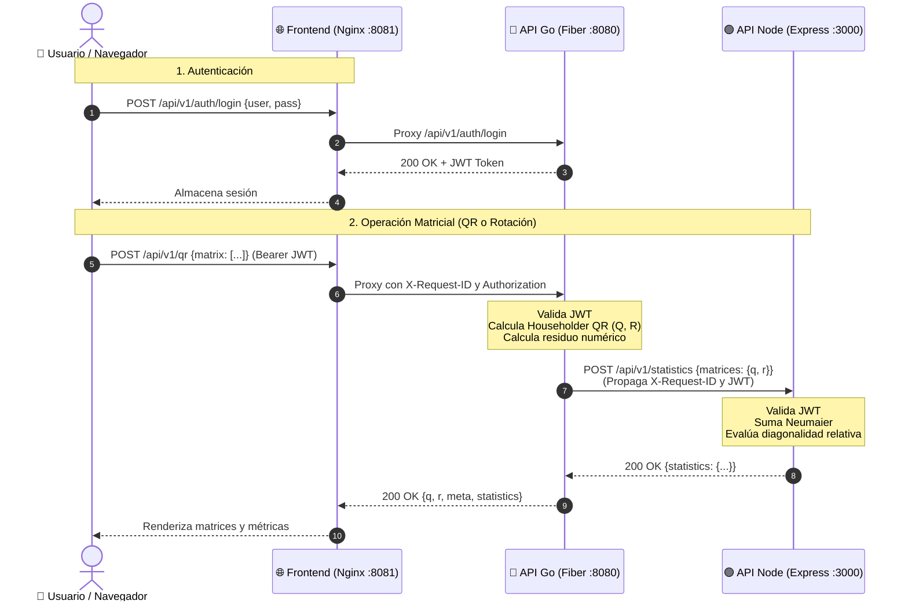

# 🚀 Coding Challenge Interseguro — Factorización QR y Estadísticas

<div align="center">

[](https://go.dev/)
[](https://gofiber.io/)
[](https://nodejs.org/)
[](https://www.typescriptlang.org/)
[](https://react.dev/)
[](https://www.docker.com/)
[](docs/DECISIONES.md)

**Solución integral y de alta precisión numérica compuesta por dos microservicios REST desacoplados y una interfaz web moderna.**

[🚀 Arranque Rápido](#-arranque-rápido) •
[🏛️ Arquitectura](#️-arquitectura-y-flujo) •
[📐 Rigor Matemático](#-rigor-matemático-y-algoritmos) •
[💻 Uso y API](#-prueba-rápida-vía-cli) •
[🧪 Pruebas y Cobertura](#-pruebas-y-cobertura) •
[📖 Documentación](#-documentación-detallada)

</div>

---

## 📌 Resumen del Sistema

El proyecto resuelve el desafío técnico implementando una arquitectura de microservicios distribuida, segura y numéricamente rigurosa:

- 🔹 **API Go (Fiber)**: Recibe matrices rectangulares $m \times n$, calcula la **factorización QR** mediante **reflexiones de Householder** (o **rotación en 90°** en sentido horario) sin dependencias externas de álgebra lineal, emite/valida tokens JWT y delega el análisis estadístico a la segunda API.
- 🔹 **API Node.js (Express + TypeScript)**: Servicio de cálculo estadístico protegido que procesa las matrices resultantes para obtener **máximo, mínimo, promedio, suma total con compensación de Neumaier** y **detección de matrices diagonales con tolerancia adaptativa**.
- 🔹 **Frontend (React 19 + Vite + Tailwind CSS)**: Interfaz de usuario intuitiva con autenticación, validación de entradas matriciales, selector de operaciones y renderizado interactivo de resultados numéricos y matrices.

---

## 🚀 Arranque Rápido

Solo se requiere **Docker** y **Docker Compose**.

### 1. Clonar y Levantar

```bash
# 1. Configurar variables de entorno iniciales
cp .env.example .env

# 2. Construir e inicializar los contenedores
docker compose up --build
```

### 2. Servicios Disponibles

| Servicio | URL Pública / Host | Puerto | Descripción |
| :--- | :--- | :--- | :--- |
| **Frontend** | [http://localhost:8081](http://localhost:8081) | `8081` | Nginx sirviendo SPA y proxy reverso hacia API Go |
| **API Go** | [http://localhost:8080](http://localhost:8080) | `8080` | Factorización QR, Rotación 90° y Auth JWT |
| **API Node** | *Red interna de Docker* | `3000` | Cálculo de estadísticas (Aislada por seguridad) |

> [!NOTE]
> **Credenciales de prueba por defecto:**
> - **Usuario:** `demo`
> - **Contraseña:** `demo1234`
> *(Configurables en el archivo `.env`)*

> [!TIP]
> **Seguridad de Red:** La API Node **no expone puertos al host**. Solo es alcanzable por la API Go a través de la red interna de Docker (`challenge-net`), reduciendo la superficie de ataque al mínimo.

---

## 🏛️ Arquitectura y Flujo

El sistema garantiza trazabilidad distribuida extremo a extremo mediante la propagación del encabezado `X-Request-ID` y autenticación unificada con JWT firmado por la API Go y verificado por la API Node.



---

## 📐 Rigor Matemático y Algoritmos

```
┌─────────────────────────────────────────────────────────────────────────────┐
│                          ÁLGEBRA LINEAL & ESTADÍSTICA                       │
│                                                                             │
│   1. Factorización QR          2. Suma Compensada      3. Detección         │
│      A = Q · R                    (Neumaier)              Diagonal          │
│                                                                             │
│   Reflexiones Householder      sum + compensation      tol = max(1e-12,     │
│   Estabilidad incondicional    Error O(1) flotante     1e-9 · max|a_ij|)    │
│   Residuo: ||QR - A|| / ||A||  Evita cancelación       Tolerancia relativa  │
│   ~ 1e-16 (precisión máquina)  en escalas mixtas       por matriz           │
└─────────────────────────────────────────────────────────────────────────────┘
```

1. **Reflexiones de Householder (QR Estable):** A diferencia de Gram-Schmidt clásico (que sufre pérdida severa de ortogonalidad ante matrices mal condicionadas), las transformaciones ortogonales $H = I - 2vv^T$ preservan la norma euclidiana y son numéricamente estables incluso con matrices de Hilbert ($cond(A) > 10^{10}$).
2. **Suma Compensada de Neumaier:** Previene la pérdida de significancia al sumar números en coma flotante de magnitudes dispares (e.g. $[10^{16}, 1, -10^{16}] \to 1$).
3. **Tolerancia Relativa Aislada por Matriz:** Para comprobar si una matriz es diagonal, se evalúa $|a_{ij}| \le \text{tol}$ fuera de la diagonal, donde $\text{tol} = \max(10^{-12}, 10^{-9} \cdot \max |a_{ij}|)$ calculada **independientemente** para $Q$ y para $R$, evitando enmascarar valores significativos en matrices de escala menor.
4. **Verificación Formal en Tests:** Se verifican propiedades matemáticas invariantes ($Q^T Q = I$, $Q \cdot R = A$, $R$ triangular superior) en lugar de valores fijados arbitrariamente.

---

## 💻 Prueba Rápida vía CLI

### 1. Obtener Token de Acceso
```bash
TOKEN=$(curl -s -X POST http://localhost:8080/api/v1/auth/login \
  -H "Content-Type: application/json" \
  -d '{"username":"demo","password":"demo1234"}' | grep -o '"token":"[^"]*' | cut -d'"' -f4)
```

### 2. Factorización QR (`POST /api/v1/qr`)
```bash
curl -s -X POST http://localhost:8080/api/v1/qr \
  -H "Content-Type: application/json" \
  -H "Authorization: Bearer $TOKEN" \
  -d '{
    "matrix": [
      [12, -51, 4],
      [6, 167, -68],
      [-4, 24, -41]
    ]
  }' | jq
```
*La respuesta incluye `q`, `r`, `meta.residual` ($\approx 10^{-16}$) y las `statistics` calculadas por Node.*

### 3. Rotación en 90° (`POST /api/v1/rotate`)
```bash
curl -s -X POST http://localhost:8080/api/v1/rotate \
  -H "Content-Type: application/json" \
  -H "Authorization: Bearer $TOKEN" \
  -d '{
    "matrix": [
      [1, 2, 3],
      [4, 5, 6]
    ]
  }' | jq
```

---

## 📂 Estructura del Repositorio

```
.
├── docker-compose.yml          # Orquestación multicontenedor (Frontend, API Go, API Node)
├── .env.example                # Plantilla de variables de entorno
├── docs/                       # Documentación técnica extendida
│   ├── API.md                  # Especificación de endpoints y esquemas OpenAPI
│   ├── DECISIONES.md           # Racional y justificación de arquitectura y algoritmos
│   └── DEPLOY.md               # Guías de despliegue en GCP Cloud Run, Render y Fly.io
├── api-go/                     # Microservicio en Go (Fiber)
│   ├── cmd/server/             # Entrypoint principal
│   └── internal/
│       ├── matrix/             # Álgebra lineal: Householder QR, rotación 90°
│       ├── api/                # Controladores HTTP, rutas y middleware
│       ├── auth/               # Emisión y validación de tokens JWT
│       ├── client/             # Cliente HTTP resiliente hacia API Node
│       └── config/             # Carga y validación de variables de entorno
├── api-node/                   # Microservicio en Node.js (Express + TypeScript)
│   ├── src/
│   │   ├── services/           # Lógica pura de cálculo de estadísticas y Neumaier
│   │   ├── schemas/            # Validación estricta con esquemas Zod
│   │   └── routes/ middleware/ # Capa de transporte y verificación de JWT
│   └── tests/                  # Pruebas unitarias y de integración (Jest)
└── frontend/                   # Single Page Application (React + Vite + TypeScript)
    └── src/                    # Componentes UI, estado y clientes HTTP
```

---

## 🛠️ Desarrollo Local (Sin Docker)

> **Requisitos:** Go 1.24+, Node.js 22+, npm.

```bash
# 1. Iniciar API Node (Puerto 3000)
cd api-node
npm install
JWT_SECRET=secreto-local npm run dev

# 2. Iniciar API Go (Puerto 8080)
cd ../api-go
JWT_SECRET=secreto-local DEMO_PASSWORD=demo1234 STATS_API_URL=http://localhost:3000 go run ./cmd/server

# 3. Iniciar Frontend (Puerto 5173 con proxy automático a :8080)
cd ../frontend
npm install
npm run dev
```

---

## 🧪 Pruebas y Cobertura

Ambos servicios cuentan con suites de pruebas exhaustivas que cubren casos nominales, casos borde, estrés numérico y modos de fallo.

```bash
# Ejecutar tests de Go con reporte de cobertura
cd api-go && go test ./... -cover

# Ejecutar tests de Node.js con Jest
cd api-node && npm run test:coverage
```

### Matriz de Cobertura

| Módulo / Paquete | Cobertura | Casos y Escenarios Clave Evaluados |
| :--- | :---: | :--- |
| `api-go/internal/matrix` | **97.2%** | $QR$ probado por invariantes ($QR=A$, $Q^TQ=I$, $R$ triangular). Matrices de Hilbert ($cond > 10^{10}$), rango deficiente y escalares extremos ($10^{150}$, $10^{-150}$). |
| `api-go/internal/api` | **94.3%** | Enrutamiento, middleware de autenticación, validación de payloads y fallos del upstream. |
| `api-go/internal/config` | **92.3%** | Valores predeterminados, parsing de entornos y rechazo de configs no válidas. |
| `api-go/internal/auth` | **89.5%** | Emisión, expiración, firmas alteradas y mitigación de ataque `alg: none`. |
| `api-node/src/services` | **100.0%** | Precisión de Neumaier, tolerancia adaptativa y verificación de diagonalidad. |
| **Total Suite `api-node`** | **92.1%** | 65 pruebas automatizadas entre unitarias y de integración. |

---

## ☁️ Preparación para Producción

Las imágenes Docker utilizan construcción en múltiples etapas (*multi-stage builds*) para optimizar el tamaño, eliminar herramientas de compilación del artefacto final y ejecutar con usuarios sin privilegios (*non-root*).

| Contenedor | Base Image | Tamaño Final | Características de Seguridad |
| :--- | :--- | :---: | :--- |
| `api-go` | Distroless / Scratch | **28.2 MB** | Non-root (`uid 10001`), `HEALTHCHECK`, `SIGTERM` ordenado |
| `frontend` | Nginx Alpine | **92.9 MB** | Configuración no privilegiada, compresión gzip, proxy API |
| `api-node` | Node 22 Alpine | **254.0 MB** | Solo dependencias de producción, usuario `node` |

---

## 📖 Documentación Detallada

Para profundizar en los detalles técnicos de la solución:

- 📑 [**docs/DECISIONES.md**](docs/DECISIONES.md) — Racional de diseño, análisis comparativo Householder vs Gram-Schmidt, suma compensada y arquitectura de seguridad.
- 📑 [**docs/API.md**](docs/API.md) — Especificación completa de contratos, esquemas JSON y códigos de estado HTTP.
- 📑 [**docs/DEPLOY.md**](docs/DEPLOY.md) — Guías paso a paso para despliegue en Google Cloud Run, Render y Fly.io.

---

<div align="center">
Desarrollado con rigor técnico y buenas prácticas de ingeniería de software.
</div>
